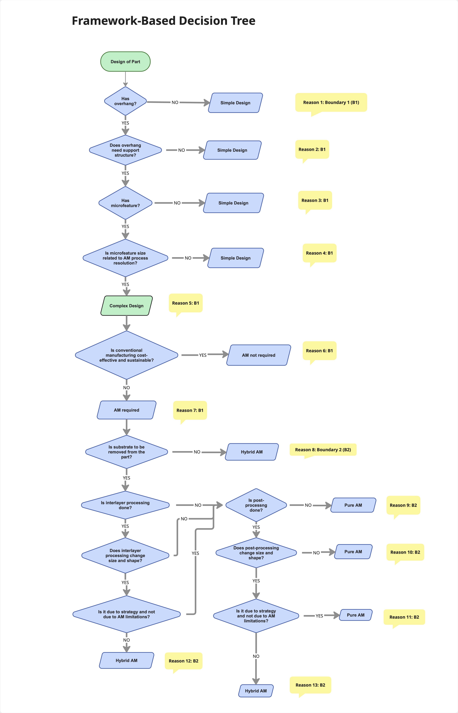

# Twin-Boundary Framework for Additive Manufacturing

An industrial decision-tree designed to classify part designs and distinguish additive manufacturing from hybrid additive manufacturing is given.

**Author:** Sanjay Kumar
> 📖 **Origin of the framework:** **[Hybrid Additive Manufacturing Debate](https://papers.ssrn.com/sol3/papers.cfm?abstract_id=7282200)**. 

## 📊 The Framework Flowchart

## 🔍 How it Works

It relies on twin-boundary framework for additive manufacturing (AM), given in the aforementioned book. It has the following two boundaries:

### Boundary 1 (B1):
_A complex shape is preferred. A shape is complex if it has at least one microfeature and an overhang_.
### Boundary 2 (B2): 
 _Pre-processing, interlayer processing, and post-processing are not meant to change size and shape. If they change, the resulting process is hybrid AM_.
 

## 💡 Explanation of Reasons mentioned in Flowchart

* **Reason 7:** A complex shape is preferred in AM only when it is not sustainable and cost-effective to be made in conventional manufacturing.
* **Reason 8:** If a substrate is not separated from a part, it means the substrate is a component of the final part. It means AM is used to modify a pre-processed substrate, which is hybrid AM.
* **Reason 11:** If post-processing is used as a strategy, it is pure AM. For example, if it is used to decrease the size to eliminate surface roughness, for which material allowance is given, it is pure AM.
* **Reason 13:** For example, if post-processing is used to remove material because a shape could not be formed by AM, it is hybrid AM.

## 🚀 Citation

If you use this framework or flowchart in your research, please reference the original text:
* **Citation:** *S. Kumar (2026) Hybrid Additive Manufacturing Debate, Scholarly Dialogues Press,https://doi.org/10.31224/7951.* 

## ⚖️ License
The documentation and flowchart logic in this repository are licensed under the **MIT License** (for software implementations) and **Creative Commons Attribution 4.0 International (CC BY 4.0)** (for text and media). 

You are free to build software based on this framework, provided that proper attribution to the original author and the book *Hybrid Additive Manufacturing Debate* is maintained.
